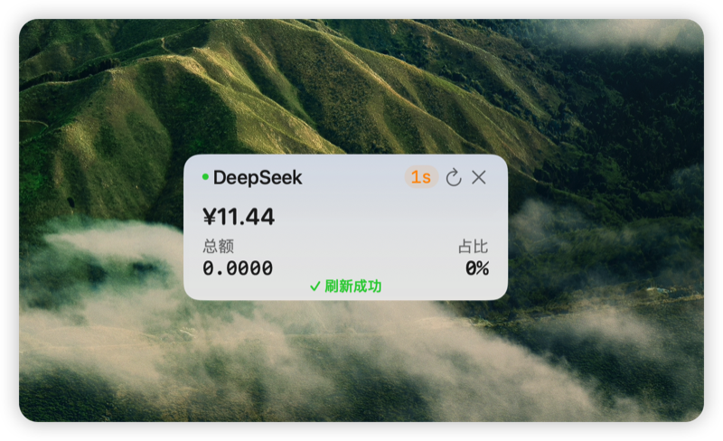

# DeepSeek Balance

macOS 菜单栏余额监控小工具 —— 实时查看 DeepSeek API 账户余额。


## 功能

- 菜单栏显示 DeepSeek API 余额
- 支持多种余额查询 API 端点自动适配
- 悬浮窗模式，可自定义位置、大小、字体
- 可配置刷新频率（30 秒 ~ 30 分钟）
- 支持自定义 API 地址（兼容第三方代理/中转）
- 可选设置总额度，显示已用比例

## 截图

| 菜单栏弹窗                                      | 悬浮窗                                    |
|--------------------------------------------|----------------------------------------|
|  |  |

## 系统要求

- macOS 12.0 (Monterey) 或更高
- Apple Silicon 或 Intel

## 安装

### 从源码构建

```bash
git clone https://github.com/Monster0303/deepseek-balance.git
cd DeepseekBalance
./build.sh
```

产物在 `build/DeepseekBalance.app`。

或使用 Swift Package Manager：

```bash
swift build -c release
```

### 运行

首次启动会自动弹出设置窗口，输入你的 DeepSeek API Key 即可。

## 使用说明

1. 点击菜单栏图标 🪭 打开弹窗
2. 点击齿轮图标 ⚙️ 进入设置
3. 填入你的 DeepSeek API Key（可在 [DeepSeek 开放平台](https://platform.deepseek.com) 获取）
4. 可选调整刷新频率、API 地址、总额度等
5. 在弹窗中可开启"浮动窗"模式，将余额悬浮显示在桌面上

## 安全

- API Key 以 Base64 编码存储在 `~/Library/Application Support/DeepseekBalance/config`，不会上传到任何第三方服务器
- 所有网络请求仅发送到你配置的 API 地址
- 无任何遥测或数据分析

## 许可证

[MIT](LICENSE)

## 免责声明

本工具是开源社区项目，与 DeepSeek 官方无关。使用风险自负。
